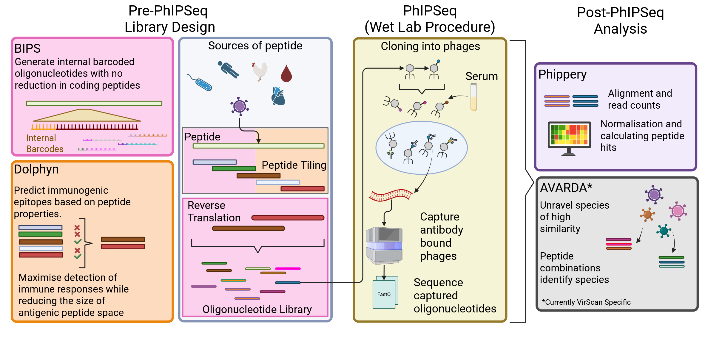

# Wookflow Pipeline

## Introduction

**nf-core/wookflow** is a bioinformatics pipeline that integrates several tools into one. The pipeline can be broken down into two components. Pre-PhIPSeq oligonucleotide library generation and Post-PhIPSeq sequence analysis. Briefly, PhIPSeq (Phage Immunoprecipitate Sequencing) is a technique that makes use of phages to display peptides on the surface such that antibodies can bind onto. This is followed by separating phages bound by antibodies to those that aren't through the use of magnetic beads. Non-bound beads are then washed away with the remaining bound phages progress to sequencing. For Pre-PhIPSeq BIPS and Dolphyn have been integrated to support custom oligonucleotide library support while phippery supports Post-PhIPSeq data analysis. AVARDA (also Post-PhIPSeq) is a VirScan (defined Human virome oligonucleotide library) Library specific tool that helps to identify individual species of viruses when cross-reactivity exists (Fig. 1). Unfortunately the open source AVARDA is currently an unmonitored project with developers having moved on, implementations adapting AVARDA to other oligonucleotide library will be a future project (unsure when).

Pre-PhIPSeq library generation (Fig. 1) aims to provide an integrated approach to go from protein sequences direcctly to oligonucleotide library such that it can be synthesised and be ready for PhIPSeq experiments. Post-PhIPSeq analysis (Fig. 1) aims to allow a smooth flow from fastq files to read counts data that are ready for down stream analyses. While phippery outputs counts data together with edgeR hits to identify peptides that were significantly occurring above background noise, AVARDA will take the hits data to determine which species have been observed based on the peptide hits. AVARDA also accounts for the potential similarity between peptides that come from organisms with high similarity in their genetics. This in turn allows the determination of whether a species can be uniquely identified as due to existence of peptides that were exclusively from that species.



***Fig 1.** WookScan overview. Left side illustrates Pre-PhIPSeq library generation and right side shows Post-PhIPSeq analysis. The centre component illustrates the wet laboratory procedure during a PhIPSeq experiment. Figure generated using BioRender (www.biorender.com)*


**Note:** You cannot run Pre-PhIPSeq and Post-PhIPSeq at the same time because the input of Post-PhIPSeq requires the actual sequencing data generated from the wetlab (PhIPSeq) experiment.

## Running Pre-PhIPSeq pipeline to generate oligo libraries

```
# Mode 1: bips_then_dolphyn (Full Workflow) #
# This mode takes a directory of protein sequence files, runs BIPS to generate a barcoded library #
# then uses Dolphyn to generate the predicted epitopes, and pass to BIPS to filter out barcoded library with the predicted epitopes. #
# The input viral sequence file(s) must be .fa or .csv format #
nextflow run /home/shouyu/Preston_VirScan_Nextflow/main.nf \
--mode bips_then_dolphyn \
-profile docker \
--input_viral_seqs_dir /path/to/your/virus_directory/ \
--outdir /path/to/your/result_directory/

# Mode 2: bips_only #
# This mode runs only the BIPS part to generate a complete barcoded oligo library from the input proteomes. #
# The input viral sequence file(s) must be .fa or .csv format #
nextflow run /home/shouyu/Preston_VirScan_Nextflow/main.nf \
--mode bips_only \
-profile docker \
--input_viral_seqs_dir /path/to/your/virus_directory/ \
--outdir /path/to/your/result_directory/

# Mode 3: dolphyn_standalone #
# This mode runs Dolphyn as a standalone tool on protein FASTA file to predict epitopes. #
# The input viral protein sequence file(s) can be .fa single sequences line format or multi sequences lines. dolphyn_standalone can convert multi-line sequences fasta into single line. #
nextflow run /home/shouyu/Preston_VirScan_Nextflow/main.nf \
--mode dolphyn_standalone \
-profile docker  \
--input_protein_fasta_dir /path/to/your/protein_fa_dir \
--outdir /path/to/your/result_directory/


# Mode 4: dolphyn_oligo_only (On Pre-computed Oligos) #
# This mode runs Dolphyn on a set of existing oligonucleotide sequences. #

# Situation A: The input oligos sequence file(s) must be .fa single sequence line format #
nextflow run /home/shouyu/Preston_VirScan_Nextflow/main.nf \
--mode dolphyn_oligo_only \
-profile docker \
--input_oligos_fasta_dir /path/to/your/oligo_fa_dir \
--outdir /path/to/your/result_directory/

# Situation B: The input oligos sequence file(s) must be .csv format #
nextflow run /home/shouyu/Preston_VirScan_Nextflow/main.nf \
--mode dolphyn_oligo_only \
-profile docker \
--input_oligos_csv_dir /path/to/your/oligo_csv_dir \
--outdir /path/to/your/result_directory/

# The Example input oligos sequence files in .fa and .csv are located in "assets/oligo_csv" and "assets/oligo_fa". #

```

**Note**: If you want to test the success of the Pre-PhIP-Seq pipeline, you can use the built-in test configuration file. This test configuration file is located in `conf/test.config`. This configuration file uses the virus sequence files located in the `assets/bips_test_data`, `assets/oligo_csv`, `assets/oligo_fa` directories of the project.

Open the `conf/test.config file`, since the test of four modes are commented out, you are required to uncomment them before testing each one. Then, run the pipeline test using the command
```sh
nextflow run main.nf -profile test
```
This command provides a standardized and fully reproducible method for each workflow branch.

## Running Post-PhIPSeq Analysis on fastq files

Two main files that are required for Phippery component is the `--sample_table` which stores information about location of the fastq files, along with metadata associated with the samples. The second file is the `--peptide_table`, and this table stores the annotations of each peptide in the PhIPSeq Library. For example in the VirScan library, each one of the 106,678 peptides will have **Species**, **Prot** etc. to be used as reference for determining how many sequenced reads fall into what peptide from which species.

General phippery runs assume fastq files are already trimmed and filtered. You can optionally give the raw fastq files to wookflow and then turn `--run_fastp True` in the parameters and Wookflow will run them through fastp. To specify the path of fastq files edit it in the `.csv` file for `--sample_table` input.

```
# Running Phippery Only #

nextflow run /home/preston/PhIPSeq-Pipelines/nf-core-wookflow/main.nf \
--run_phippery True \
-profile docker \
--peptide_table InputFiles/peptide_table_VIR3_full_v7.csv \
--sample_table InputFiles/sample_table_UNSW_VirScan.csv \
--run_cpm_enr_workflow true \
--oligo_tile_length 50 \
--read_length 51 \
--results ../TestWookFlow/WookScanNextFlowTest \
--dataset_prefix "data"

# Running Phippery & AVARDA #

nextflow run ../nf-core-wookflow/main.nf \
--run_phippery True \
--run_AVARDA True \
-profile docker \
--peptide_table InputFiles/peptide_table_VIR3_full_v7.csv \
--sample_table InputFiles/sample_table_UNSW_VirScan.csv \
--run_cpm_enr_workflow True \
--oligo_tile_length 50 \
--read_length 51 \
--results ../WookScanNextFlowTest2/phippery_results \
--out_path ../WookScanNextFlowTest2/avarda_reults \
--out_name PHIPAVARDA \
--max_cpus 24 \
--max_memory '36.GB' \
--run_fastp True


# Running Only AVARDA (assumes you have some hits data) #
# Note: AVARDA only works for VirScan Library for now.

nextflow run ../nf-core-wookflow/main.nf \
--run_AVARDA True \
-profile docker \
--case_path ../nf-core-wookflow/subworkflows/local/AVARDA/data/example_input/AVARDA_test_data.tsv.gz \
--avarda_names ../nf-core-wookflow/subworkflows/local/AVARDA/data/avarda_names/avarda_names.csv.gz
--out_path ../WookScanNextFlowTest2/TestWookFlow2_AVARDA \
--out_name PHIPAVARDA \
--max_cpus 24 \
--max_memory '36.GB'

```

## Other adjustable Phippery parameters

Default values are shown in square bracers `[]`.

```
# *************************************
# Switching analysis workflows on/off *
# *************************************
    --run_zscore_fit_predict [true]        # run zscore workflow or not
    --run_cpm_enr_workflow [false]         # run counts per million workflow or not
    --run_edgeR [true]                     # run edgeR or not
    --run_BEER [false]                     # run BEER statistics or not

# *************************************
# Alignment options                   *
# *************************************
    --oligo_tile_length [117]              # peptide oligo encoding length for alignment
    --read_length [125]                    # read length for alignment
    --n_mismatches [2]                     # mismatches allowed (end-to-end)
    --replicate_sequence_counts [true]     # Flag for replicating counts for replicate sequences

# ********************************************
# Grouping peptides by species or categories *
# ********************************************
    --summarize_by_organism [true]              # turn on summarise peptide detection by organism
    --max_overlap [7]                           # Maximum allowed overlap between detected peptides
    --zscore_threshold [2.5]                    # Minimum z-score threshold
    --edgeR_threshold [0.05]                    # Maximum edgeR threshold (BH-adjusted p-value)
    --peptide_org_col [Species]                 # Column in the peptide table indicating the organism for each peptide
    --sample_grouping_col [sample_source]       # Column in the sample table used for mapping replicates to samples
    --peptide_seq_col [Prot]                    # Column in the peptide table containing the peptide sequence (For matching known epitopes & filter overlapping peptides)

    # Below params are optional to include when summarize_by_organism is switched on.

    # Directory for storing known epitopes to check alignment with peptides
    # $projectDir is a nextflow variable of where the nextflow project is stored.
    --public_epitopes_csv = [$projectDir/templates/public_epitope_template.csv"]

    # Column name containing the translated amino acid sequence for known epitopes
    --public_epitopes_col [peptide_translate]

# **************************
# Output file type options *
# **************************
    --output_tall_csv [true]              # dish out tall (long) format csv
    --output_pickle_xarray [true]         # Output Xarray pickle (.phip file)
    --output_wide_csv [true]              # Output wide format ds

# *************************************
# Output file location options        *
# *************************************
    --results [$PWD/phippery_results]       # setting where to output results to


# **********************************
# Other available option(s)        *
# **********************************
    --dataset_prefix [data]              # the name of .phip file. E.g. data.phip
    --user_pep_id [WOOKSCAN_000]         # Prefix of user_pep_id for AVARDA's use
    --fastq_stream_func [zcat]           # sample read options. Set this as 'cat' if fastq files not g'zipped. Change to 'gzcat' if you're on macOS.
```

### Note on sample and peptide tables

Below are two examples of what sample table and peptide table should look like. For sample table, `fastq_filespath` and `control_status` is required. other columns are optional and can be mentioned in the parameters when using certain workflows (for example, when `--summarize_by_organism` option is on, ` --sample_grouping_col` can be set to `sample_source` column).

Peptide table requires minimum columns `peptide_id` and `oligo`. Similar to sample table, other additional columns are optional (for example, when `--summarize_by_organism` option is on, `--peptide_org_col` can be set to `Species` column).


**Example column titles for sample table:**
|fastq_filepath|control_status|technical_replicate_id|sample_source|
|----|----|----|----|
PATH/TO/sampleA_rep1_raw.fastq.gz|empirical|A-1|Sample_A|
PATH/TO/sampleA_rep2_raw.fastq.gz|empirical|A-2|Sample_A|
PATH/TO/sampleA_rep3_raw.fastq.gz|empirical|A-3|Sample_A|
PATH/TO/sampleB.rep1_raw.fastq.gz|empirical|B-1|Sample_B|
PATH/TO/sampleB.rep2_raw.fastq.gz|empirical|B-2|Sample_B|
PATH/TO/sampleB.rep3_raw.fastq.gz|empirical|B-3|Sample_B|
PATH/TO/beads_only_BG1_raw.fastq.gz|beads_only|BG-01|BG|
PATH/TO/beads_only_BG2_raw.fastq.gz|beads_only|BG-02|BG|
PATH/TO/beads_only_BG3_raw.fastq.gz|beads_only|BG-03|BG|
PATH/TO/beads_only_BG4_raw.fastq.gz|beads_only|BG-04|BG|
PATH/TO/beads_only_BG5_raw.fastq.gz|beads_only|BG-05|BG|


**Example column titles for peptide table:**
|peptide_id|original_id|oligo|UniProtEntry|VIR3Expanded_id|Species|Prot
|-----|-----|-----|-----|-----|-----|-----|
|0|1|ATGCGCAGCTTGCTGTTTGTGGTCGGTGCTTGGGTCGCTGCTCTCGTCAC|A0A126|1|Papiine herpesvirus 2|MRSLLFVVGAWVAALVTNLTPDAALASGTTTTAAAGNTSATASPGDNATSIDAGST|
|1|2|ACTACAACCACCGCTGCCGCAGGGAACACATCTGCAACAGCTTCTCCAGG|A0A126|2|Papiine herpesvirus 2|TTTTAAAGNTSATASPGDNATSIDAGSTITAAAPPGHSTPWPALPTDLALPLVIGG|
|2|3|ATTACCGCTGCCGCTCCTCCAGGTCATTCAACACCTTGGCCTGCACTCCC|A0A126|3|Papiine herpesvirus 2|ITAAAPPGHSTPWPALPTDLALPLVIGGLCALTLAAMGAGALLHRCCRRCARRRQN
|3|4|TTGTGCGCCCTCACACTCGCAGCAATGGGCGCCGGGGCATTGCTTCATCG|A0A126|4|Papiine herpesvirus 2|LCALTLAAMGAGALLHRCCRRCARRRQNVSSVSA|
|4|5|CGCGATCGCGGCCCTTCTCGCTCTCGCGTGCGCTACACCCGCCTGGCTGC|A0A130|5|Papiine herpesvirus 2|RDRGPSRSRVRYTRLAASEA|
|5|6|ATGGGGTTTGGCGCCGCAGCAGCACTGTTGGCTCTGGCAGTTGCACTCGC|A0A132|6|Papiine herpesvirus 2|MGFGAAAALLALAVALARVPAGGGAYVPVDRALTRVSPNRFRGSSLPPPEQKTDPP|
|6|7|GTGGACCGCGCACTCACACGCGTTAGCCCAAACCGCTTCCGCGGTTCATC|A0A132|7|Papiine herpesvirus 2|VDRALTRVSPNRFRGSSLPPPEQKTDPPDVRRVYH|


## AVARDA parameters
Default values are shown in square bracers `[]`.

```
#############################################################
# TODO: Describe below input params and also indicate       #
#       which ones shouldn't really be fiddled with unless  #
#       you know what you're doing.                         #
#############################################################


# input 1 - file usually containing binary values of T/F or 1/0 to indicate if peptide was a hit.
    --case_path [$baseDir/subworkflows/local/AVARDA/data/example_input/AVARDA_test_data.tsv.gz]


# input 7 - location to place results
    --out_path [$PWD/avarda_results/]

# input 8 - prefix for naming output files
    --out_name [AVARDA_Output_]


# ******************************************************************
# Only change these hard coded files if you know what you're doing *
* These are all set by original authors of AVARDA.                          *
# ******************************************************************

# input 2 - thershold 1 means input 1 is a binary file.
    --threshold [1]

# input 3 - peptide id to peptide id dictionary alignment (if the pair aligned well they are in this list)
    --dict_path [$baseDir/subworkflows/local/AVARDA/data/dict_path/my_df.csv.gz]

# input 4 - Total expected probabilities of species based on VirScan Library
    --total_path [$baseDir/subworkflows/local/AVARDA/data/total_path/total_probability_xr2.csv.gz]

# input 5 - pairwise expected probability of obtaining a species X given species Y.
    --pairwise_path [$baseDir/subworkflows/local/AVARDA/data/pairwise_path/unique_probabilities3.csv.gz]

# input 6 - blast alignment results of all the peptides to species. Values SHOULD BE bitscore
# but for some reason looks more like percentage identity
    --blast_path [$baseDir/subworkflows/local/AVARDA/data/blast_path/VirScan_filtered_virus_blast_new.csv.gz]

# input 9 - file detailing peptide ids for connecting peptide <-> hits
    --avarda_names [$baseDir/subworkflows/local/AVARDA/data/avarda_names/avarda_names.csv.gz]


```


## Pipeline output

When generating the Pre-PhIPSeq oligonucleotide library, the output will be located at where you've defined  `--outdir` to be.


## Contributors to WookScan

**Bioinformaticians involved in the pipeline development:**
 - Preston Leung
 - Bea Delgado-Corrales
 - Legana Fingerhut
 - Shouyu (Coco) Wei


We also thank the following people for their extensive assistance in the development of this pipeline:

- Ki Wook Kim
- Steven Grant Rogers


<!-- TODO nf-core: If applicable, make list of people who have also contributed -->

## Support WookScan

If you would like to contribute to this pipeline, please see the [contributing guidelines](.github/CONTRIBUTING.md).

For further information or help, don't hesitate to get in touch on the [Slack `#wookflow` channel](https://nfcore.slack.com/channels/wookflow) (you can join with [this invite](https://nf-co.re/join/slack)).

## Citations

<!-- TODO nf-core: Add citation for pipeline after first release. Uncomment lines below and update Zenodo doi and badge at the top of this file. -->
<!-- If you use nf-core/wookflow for your analysis, please cite it using the following doi: [10.5281/zenodo.XXXXXX](https://doi.org/10.5281/zenodo.XXXXXX) -->

<!-- TODO nf-core: Add bibliography of tools and data used in your pipeline -->

nf-core/wookflow was originally written by Preston Leung, but the components that made up the pipeline are written by their respective authors. An extensive list of references for the tools used by the pipeline can be found in the [`CITATIONS.md`](CITATIONS.md) file.


## Other stuff todo later

> [!WARNING]
> Please provide pipeline parameters via the CLI or Nextflow `-params-file` option. Custom config files including those provided by the `-c` Nextflow option can be used to provide any configuration _**except for parameters**_;
> see [docs](https://nf-co.re/usage/configuration#custom-configuration-files).

For more details and further functionality, please refer to the [usage documentation](https://nf-co.re/wookflow/usage) and the [parameter documentation](https://nf-co.re/wookflow/parameters).


To see the results of an example test run with a full size dataset refer to the [results](https://nf-co.re/wookflow/results) tab on the nf-core website pipeline page.
For more details about the output files and reports, please refer to the
[output documentation](https://nf-co.re/wookflow/output).
